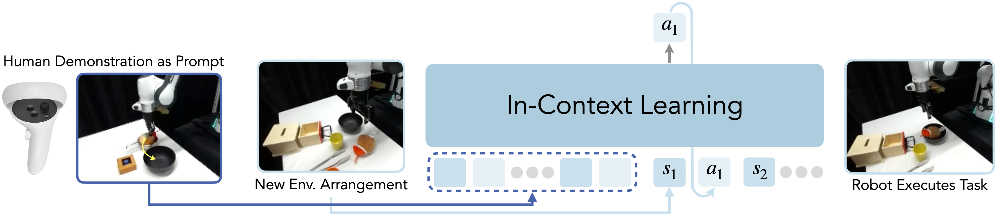

# In-Context Imitation Learning via Next-Token Prediction
by <a href="https://max-fu.github.io">Max (Letian) Fu*</a>, <a href="https://qingh097.github.io/">Huang Huang*</a>, <a href="https://www.linkedin.com/in/gaurav-datta/">Gaurav Datta*</a>, <a href="https://yunliangchen.github.io/">Lawrence Yunliang Chen</a>, <a href="https://autolab.berkeley.edu/people">William Chung-Ho Panitch</a>, <a href="https://fangchenliu.github.io/">Fangchen Liu</a>, <a href="https://www.research.autodesk.com/people/hui-li/">Hui Li</a>, and <a href="https://goldberg.berkeley.edu">Ken Goldberg</a> at UC Berkeley and Autodesk (*equal contribution).

[[Paper](https://arxiv.org/abs/2408.15980)] | [[Project Page](https://icrt.dev/)] | [[Checkpoints](https://huggingface.co/mlfu7/ICRT)] | [[Dataset](https://huggingface.co/datasets/Ravenh97/ICRT-MT)]

<p align="center">
  
</p>


This repo contains the official implementation for *In-Context Imitation Learning via Next-Token Prediction*. We investigate how to extend few-shot, in-context learning capability of next-token prediction models to real-robot imitation learning. Specifically, given a few teleop demonstrations of the task, we want the model to predict what to do in a new setting, without additional finetuning on these demonstrations. 

Further information please contact [Max Fu](https://max-fu.github.io) and [Huang Huang](https://qingh097.github.io/), or post an issue on Github!

## Todos
- [ ] Release DROID subset that is used for pre-training ICRT.

## Latest Updates
* [2024-08-23] Initial Release

## Setup
```bash
# create conda env
conda create -n icrt python=3.10 -y
conda activate icrt
# install torch
conda install pytorch torchvision torchaudio pytorch-cuda=12.4 -c pytorch -c nvidia 
conda install -c conda-forge ffmpeg
# download repo 
git clone https://github.com/Max-Fu/icrt.git
cd icrt 
pip install -e .
```

## Dataset

Please refer to [DATASET.md](DATASET.md) for downloading datasets and constructing your own dataset.

## Checkpoints
We host the checkpoints on [🤗HuggingFace](https://huggingface.co/mlfu7/ICRT). Please follow the following instructions to download them.
```bash 
# install git-lfs
sudo apt install git-lfs
git lfs install
# cloning checkpoints
git clone git@hf.co:mlfu7/ICRT checkpoints
```

## Model Training 

Please refer to [TRAIN.md](TRAIN.md) for training the model.

## Model Inference

Please look at [inference.ipynb](tools/inference.ipynb) for examples on inferencing ICRT.

## License
This project is under the Apache 2.0 license. See [LICENSE](LICENSE.txt) for details.

## Citation 
Please give us a star 🌟 on Github to support us!

Please cite our work if you find our work inspiring or use our code in your work:
```
@article{fu2024icrt,
    title={In-Context Imitation Learning via Next-Token Prediction}, 
    author={Letian Fu and Huang Huang and Gaurav Datta and Lawrence Yunliang Chen and William Chung-Ho Panitch and Fangchen Liu and Hui Li and Ken Goldberg},
    journal={arXiv preprint arXiv:2408.15980},
    year={2024}
}
```